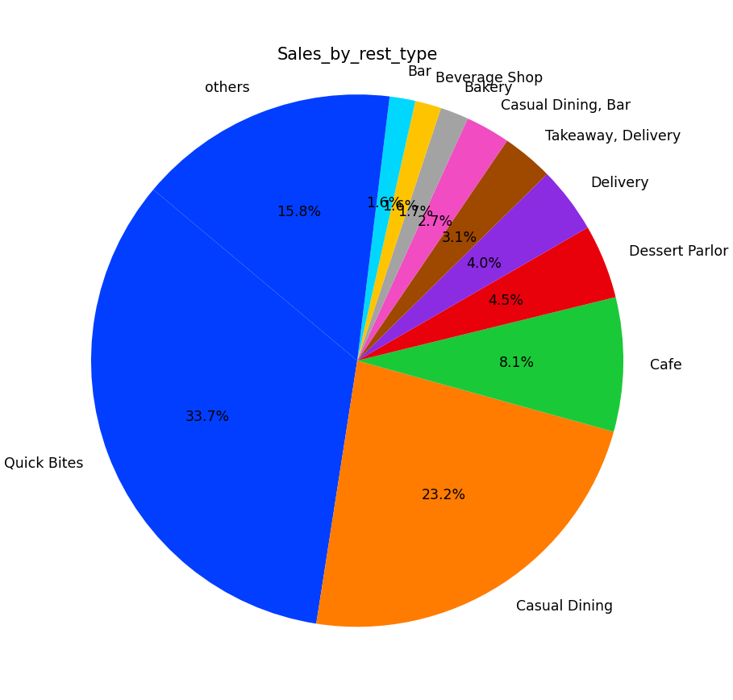
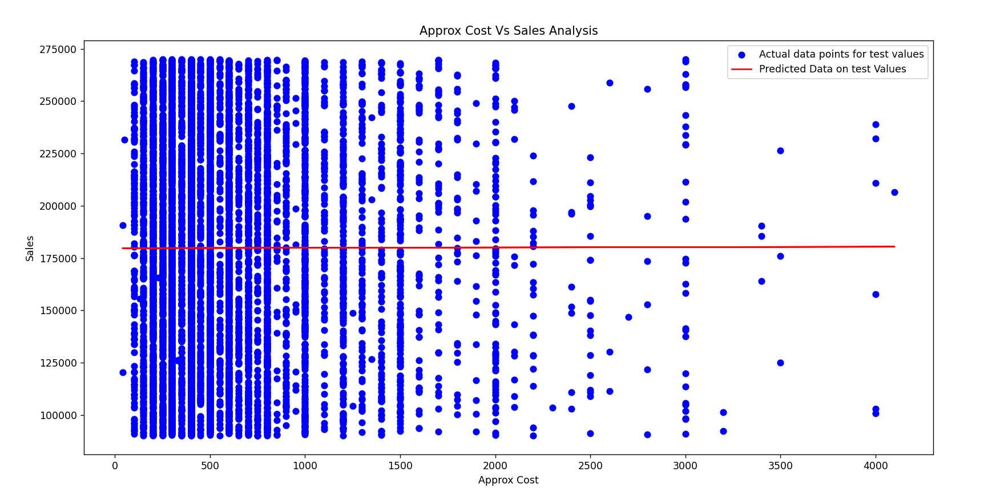

# Analysis Questions

## Questions for Consumers

1. **Does money and rating have a correlation?**
   - Yes, the correlation between money (cost) and rating is 0.38154, indicating a moderate positive relationship. This means that as restaurant costs increase, ratings tend to improve, but the link is not strong. Other factors like food quality, service, and ambiance likely influence ratings as well, so while higher-cost restaurants may generally have better ratings, it’s not guaranteed.
   
2. **Which cities are the most expensive and have the best ratings?**
   - Out of the top 25 resturants based on most expenses and best ratings , Malleshwaram ranks at the top with 5 out of 25 resturants in Malleshwaram

3. **Which place is the cheapest and has the best rating?**
   - Out of the top 25 resturants based on least expenses and best ratings , Banashankari ranks at the top with 4 out of 25 resturants in Banashankari 

4. **Whose overall rating is better, Banashankari or Malleshwaram?**
   - The ratings are similar: Banashankari has a average rating of 3.6, while Malleshwaram has 3.7. However, Banashankari is cheaper with an average cost of 426.3, compared to Malleshwaram’s 618.36.
   So , Banashakari's have something to brag about infront of Malleshwari's

5. **Which city provides the most options for ordering online?**
   - BTM is the lazy person's paradise , with offering 1886 online ordering options , the most out of any other city.

6. **Do restaurants that offer home delivery have better ratings?**
   - The clear answer is NO. The average ratings for resturants offers home delivery have a average rating of 3.6 , while the ones who don't provide home delivery has a average rating of 3.7

7. **Which city has restaurants with the most votes and the best rating?**
   - Koramangala 7th Block comes out at top , with 14 resturants out of the top 100 , in terms of most votes and rating.

## Questions for Business Owners

1. **What are the top 5 restaurant types performing well in Bangalore (by sales per store)?**
   - Quick Bites, Casual Dining, Cafe, Dessert Parlour, Delivery
     Here is a bar graph which shows top 10 categories and their market share.
     

2. **What are the worst 5 restaurant types (by sales per store)?**
   - Desert Parlor & Food Court, Desert Parlor & Kiosk, Bakery & Food Court, Casual Dining & Lounge, Cafe & Food Court. Looks Bangalorians doesn't like sweet( can be seen in their language).

3. **What are the top 5 places to open a restaurant by sales per store?**
   - Bannerghatta Road, Kammanahalli, Bellandur, Sarjapur Road, Whitefield.

4. **What are the worst 5 places to open a restaurant by sales per store?**
   - Frazer Town, Malleshwaram, New BEL Road, Electronic City, Koramangala 6th Block. 

5. **What are the top 5 restaurant types that work well in the top 5 cities?**
   - **Bannerghatta Road**: Food Court & Casual Dining, Cafe & Quick Bites, Dhaba, Food Court & Dessert Parlour, Beverage Shop & Dessert Parlour.
   - **Kammanahalli**: Quick Bites & Mess, Bakery & Cafe, Pub & Casual Dining, Quick Bites & Meat Shop, Dessert Parlor & Bakery.
   - **Bellandur**: Club, Pub & Casual Dining, Food Court & Quick Bites, Microbrewery & Casual Dining, Quick Bites & Food Court.
   - **Sarjapur Road**: Quick Bites & Food Court, Cafe & Casual Dining, Quick Bites & Beverage Shop, Beverage Shop & Cafe, Dessert Parlor & Quick Bites.
   - **Whitefield**: Quick Bites & Dessert Parlour, Bhojnalaya, Casual Dining & Quick Bites, Bar & Lounge, Casual Dining & Microbrewery.

5. **Are Approximate Costs for Two People and Sales Proportional?**   
   - It turns out that approximate costs for two people and sales show no significant relationship. To reach this conclusion, I applied a linear regression model. The dataset was split into two parts: 80% for training and 20% for testing. The model was trained on the training data, and predictions for sales were made based on the unseen test data using the approximate cost for two people as the input variable.

   I then evaluated the model's performance by comparing the predicted sales values with the actual test data, calculating the R² and Mean Squared Error (MSE). The results were as follows:

   R² = -9.576842916558803e-05: This value is extremely close to zero and slightly negative, indicating that there is no linear correlation between the approximate cost and sales.
   MSE = 2,700,360,008.67: The large MSE value suggests a substantial difference between the predicted and actual sales values, further supporting the conclusion that there is no linear relationship between these two factors.

   Here's the graph of the Linear Regression Model : 
   